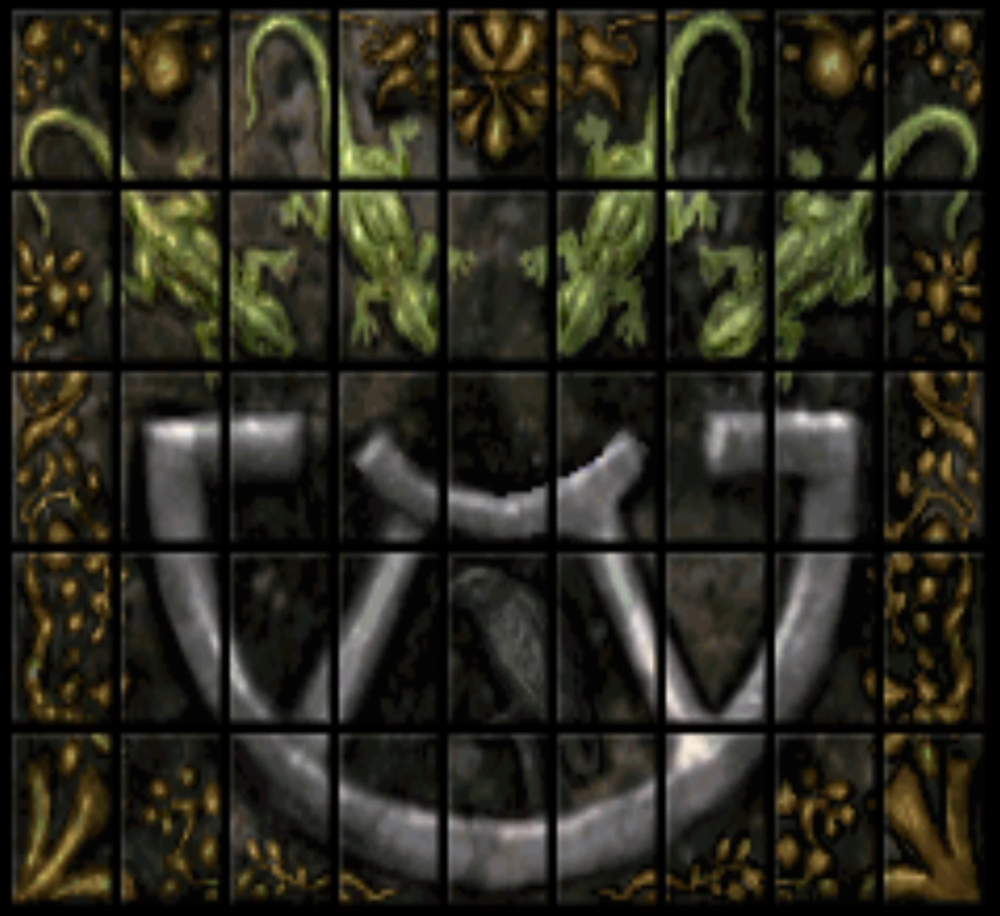

# Important key short cuts
- F10 - inventory
- F6 - map
- F7 - save
- F3 - settings

# General information
[NLT Wiki - Schatten über Riva](http://nlt-wiki.crystals-dsa-foren.de/doku.php/schatten_ueber_riva)\
Open settings, set graphics to high, text display and combat speed to fast\
Load START save file

# Route
## Riva
- Choose Novice level
- Get picklocks of Calissa, give to Gorm
- Get weeds from Norat, give to Gorm
- Remove from party: Calissa, Mirena, Norat
- Add to party: Arva, Pivot, Tefan
- **5 points** after cut scene
- Go to Firun Temple, take quest
- Go to graveyard
## Boron's Field
- Go to right hut, enter
- Go to middle grave in front of gate, enter
- **5 points** after entering
- Open door to left, grab everything from chests
- Go to next door on left, fight everything
- Search left grave
- **5 points** after searching left grave
- Go back, left
- Go to second door on right, search left grave
- **5 points** after searching left grave
- Go back, left
- Go to first door on left, grab everything from left chest
- Go back, left
- Go to next door on right, grab everything, ignore bookshelf
- Go back, open hidden way next to entry, take amulets of grave
- Leave grave
- Go to left hut, fight
- **10 points** after fight
- Leave graveyard
## Riva
- Go to Firun Temple, finish quest
- Cross bridge, Holberker cut scene
- **2 points** after cut scene
- After cut scene go to market, sell stuff except whirlweed and magic potion
- Buy at grocer: torch
- Buy at blacksmith: edged w., 3x shield, 5x boots
	- For dwarf: edged w., shield, boots
	- For warriors: shield, boots
	- For mages: boots
- Buy at herb dealer: 50+ whirlweed, 6 magic potions
- Go to northern exit of market place, Lea cut scene
- **3 points** after cut scene
- Go to bar next to Tarik, sit with Tarik
- **5 points** after talking to Tarik
- Go to Rat Catcher's house, enter sewers
## New Sewers
- Left, left, right, straight, right, right, left, straight
- **2 points** after cut scene
- Left, left, right
- **3 points** after cut scene
- Right, left
- Leave sewers
## Riva
- Go to marketplace, murder cut scene
- **10 points** after cut scene
- Go to Rat Catcher's house, enter sewers
## New Sewers
- Left, left, right, straight
- **5 points** after cut scene
- Right, right, left, straight, left, left, save, straight
- **5 points** after cut scene
- Leave sewers
## Riva
- Go to marketplace, assassination cut scene
- **10 points** after cut scene
- Go to hotel, sleep until noon
- Go to marketplace, Lea cut scene
- **2 points** after cut scene
- Go to hotel, sleep until midnight
- Go to warehouse next to Efferd Temple
- Second option
## New Sewers
- Give everyone a bracelet
- **50 points** after cut scene
- Left, left, right, left
- Leave sewers
## Riva
- Go to hotel, sleep until noon, split group to only dwarf
- Go to pirate's house with dwarf, save
- Talk to pirate, watch house, follow pirate
- **7 points** after following
- Switch to other group, sleep until noon
- Switch to dwarf, take pirate document
- **3 points** after taking document
- Go to Tarik, give document
- **2 points** after delivering document
- Switch to other group
- Go to marketplace, Ordo cut scene
- Second option
- **10 points** after cut scene
- Regroup at Tarik's house
- Leave Riva through southern gate
## Riva Surroundings
- Go to Stipen, help him
- Go to weeping willow trees, blow horn
- **5 points** after blowing horn
- Go to corner of northern gate, blow horn
- **5 points** after blowing horn
- Go to boots in wall, blow horn
- **5 points** after blowing horn
- Split party to mage only, save
- Pull boots with mage, fight skeleton, use Paralyze
- Get boots, give to first warrior
- Go to rotten dock, blow horn
- **5 points** after blowing horn
- Go to shack with stacked wood, search wood stacked
- Wait for Stipen
- Take everything
- **15 points** after taking everything
- Enter Riva through northern gate
## Riva
- Sleep, get Thorgrimm
- Leave Riva through northern gate
## Riva Surroundings
- Save, go to mine
## Dwarven Mine - Level 1
- Go right, down to second level
## Dwarven Mine - Level 2
- Go left, orc cut scene, save
- Go left, go to minecart, cast banish spritis
- **5 points** after banishing spirits
- Go straight to door, fight orcs, everyone needs to be alive
- Go through door across room
- Left, straight, save
- Fight skeleton, give sword and armor to warrior
- Go back, straight, left, save, overpower and question orc
- Answers: no, no, yes, yes, no
- **20 points** after answering correctly
## Dwarven Mine - Level 3
- Save, heal party
- Go all the way back to face, answer with 'remission'
- **20 points** after answering correctly
- Go back to stain on wall, touch, open door
- Give mages magic potion if necessary
- Give mages magic potion in offhand, save
- Fight demon, cast Ignifaxius with mages, tank with melees, use magic potion on mages when necessary
- **15 points** after defeating demon
- Save, heal party
- Fight orcs
- Give plates to dwarf and warrior, belt and ring to dwarf, take jewelry
- Take book, burn with torch
- **20 points** after burning book
- Leave
## Dwarven Mine - Level 2
- Go to exit but left, save
- Slide down, fight
- **10 points** after fights
- Take everything from corpse pile
- Climb up, leave mine
## Riva Surroundings
- Enter Riva through northern gate
## Riva
- Go to marketplace
- Buy at herb dealer: 50+ whirlweed, 6 magic potions
- Go to Ordo, take quest
- **2 points** after taking quest
## Riva Surroundings
- Enter boat
## Magician's Tower - Swamp
- Save
- Go to tower's back entrance, as right as possible
- Fight swamp rantzies
- Enter tower
## Magician's Tower - Garden
- Open door, release dogs, fight
- **10 points** after fight
- Close door, save, fight Pergor
- **25 points** after fight
- Give belt to warrior, save
- Go to herb garden, take everything
- Enter hedges next to herb garden
- **1 point** after entering
- Search for corpse by hedges to left
- **2 points** after finding corpse
- Go back, enter other hedges, hug left wall
- **3 point** after entering
- Open door with last option
## Magician's Tower - Level 1
- Save, fight Pergor
- Left, left, right, save
- Open door, fight
- Open chest to right, give helmet to warrior
- Sleep (only when it works first time, heal otherwise)
- Open other door, left, left
- Open door, take dog figurine
- Open chest, take key
- Go back to the entry junction, left, left
- Use dog figurine on door
- **4 points** after opening door
- Use crank with last character
- Save, send warrior up, fight, take blue diamonds
- Switch to last character, use crank
- Switch to last character, send last character up
## Magician's Tower - Level 2
- Open chest to right, take potions, give belt to second mage, magic sword to second warrior
- Go right, ignore door to right
- Open door straight ahead
- Save, fight, take red diamonds
- Go back to entry, open door on left
- Open first door to left
- Save, fight, take yellow diamonds
- Leave room, continue left
- Use red and yellow diamonds at door
- **15 points** after opening door
- Go right, left, open door
- Save, fight, go back, unite party
- Go to end, ignore door to right
- Use statue, enter **blood washes fire cleans**
- Give belt to third mage, armor to warrior, take rest
- Go back, open door to left, go up
## Magician's Tower - Level 3
- At junctions: straight, right, right, left
- Open door, search locker, give helmet to mage
- Search cupboard, take documents
- Go to picture, answer **borbarad**, go straight
- **5 points** after answering correctly
- Save, cast foramen on chest
- Take key and bread bag, leave lunch behind
- Destroy the statue
- Go back, at junctions: right, right, right
- Save, open door, fight Pergor
- Give armor to dwarf
- Go left, search locker, take everything
- Go back, continue left
- Open door, heal party
- Save, fight Pergor, use Ignifaxius on Pergor
- **30 points** after fighting
- Give amulet to mage, take rest, save
- Go to floor pentagram, use Motoricus with mage to get magic potion
- Open door, go up
## Magician's Tower - Level 4
- Open door, heal party
- Save, fight Pergor, use Ignifaxius on Pergor
- Open western door, use teleporter
- Open northern door, save, use teleporter
- Fight, use eastern door, use teleporter
- Go right at junction, save
- Fight Pergor, finish puzzle

- Go back, at junction go straight
- Go right in bedroom, use teleporter
## Magician's Tower - Swamp
- Turn around, go through door
- Go left, enter boat
## Riva Surroundings
- Enter Riva through southern gate
## Riva
- Go to pirates house, if one doesn't work visit the other
- Go to Ordo, finish quest
- **2 points** after cut scene
- Sleep at Ordo's
- Go to marketplace
- Sell stuff, buy 50+ whirlweeds, 18+ magic potions
- Go to Gorm, confront
- **10 points** after cut scene
- Sleep for 4 days, go to marketplace, Tarik cut scene
- Go to Boron's Field, enter grave
- Put unneeded equipment in chest, keep weapons
- Go to bar next to Tarik, save, enter
- **2 points** after cut scene
## Bride of the Winds - Level 1
- Second option
- Climb through hole
- Go right, open right chest, equip everything
- Open door to north, go right, keep right
- Enter to left, keep left, use ladder
## Bride of the Winds - Level 2
- Go right, straight, keep left
- Talk to sea fairy
- Second option
- Answers: nose, sponge, sea fairy
- **15 points** after answering correctly
- Go back, keep left, save
- Open door, third option, third option, fight
- **5 points** after fighting
- Go far east, open door
- go east, open door
- Cut ropes of contraption
- Leave, keep right, go up ladder
## Bride of the Winds - Level 3
- Save, go right, open door
- Open right door to east
- First option, third option
- Go to window, save
- Leave through window
- **45 points** after cut scene
## Riva
- Go to Boron's Field, enter grave
- Get equipment from chest
- Sleep for 4 days, go to marketplace, crime cut scene
- **60 points** after cut scene
- Sleep for 4 days, go to marketplace, Tarik cut scene
- **5 points** after cut scene
- Save, enter marketplace manhole
## New Sewers
- Right, right, right, enter old sewers
## Old Sewers
- Go to iron door, talk to guild master, leave guild hideout
- **10 points** after cut scene
- Go straight, ignore wall opening, continue straight, left, left, right, left
- Enter door
## Feylamia's Hideout
- Go right, leave last character at lever
- Go other way, use lever, vampire cut scene
- Leave last character at lever
- Go to other lever, go through new way
- Unite party at first lever
- Enter new opening, open first door on right, talk to rat catcher
- Leave cell, go right, left, right, right, left, straight, left, right, right, straight
- Open door, search locker, give helmet to dwarf
- Open chest, give lantern to dwarf
- Leave room, go straight, right, straight, left, right, right, straight, right, left, left
- Open door, enter room to right
- Search shelf, take everything
- Leave room, go right, left, right
- Open door, search table, take antihypnoticum and key, give key to dwarf
- Leave room, go back to closed to to right
- Open door, open chest, give bracelet and ring to dwarf
- Use antihypnoticum, split party to dwarf, save
- Go through mirror with dwarf
- Open chest with key, take everything except bottles, lantern cut scene
- Use lantern, leave room
- **10 points** after cut scene
- Go through mirror, go through right mirror, unite with party
- Leave hideout
## Old Sewers
- Keep right, go to guild hideout
- Sleep until fully healed
- Take whirlweed
- Take new quest, leave guild hideout, save
- Go back to Feylamia's hideout, enter
- Go straight, keep right
- Save in front of raft
- Give mage magic potion in offhand
- Go on raft, fight water dragon
- Cast Ignifaxius with mages, use magic potion on mage when necessary
- **20 points** after fighting
- Leave through door
## Fortress of Riva
- Open hidden door, go in at night
- Save, go right, enter first cell, fight
- Take key from wall, leave cell, turn right
- Go straight, left before stairs
- Enter torture chamber to left, save
- Go up stairs, torture cut scene, fight
- **20 points** after fighting
- Leave, go right, right, straight, right before stairs
- Save, enter second door to left, fight, take key
- **5 points** after taking key
- Leave, go right, straight, left
- Enter fifth cell to right, mages cut scene
- **20 points** after cut scene
- Leave cell, go left, straight, right before stairs
- Go straight, up the stairs at end
- Enter first door on left, search bed
- Leave bedroom, left, straight, right at end
- Right, enter kitchen, interrogate cook, let him flee
- **5 points** after cut scene
- Save, leave through same door
- Right, straight, right, straight, left
- Disarm trap in front of door to left, force door open, enter door
- Search desk, take key, save
- Open door behind desk, enter, fight
- Move chest, enter, open chest, take urns
- **5 points** after taking urns
- Leave, go right, left, down stairs, right, straight to wall, right, straight
- Open hidden door to left in front of stairs, enter, council cut scene
- **100 points** after cut scene
- Sleep until fully healed
- Take Even Star quest, take kajubo buds
## Harbor Basin
- Save, go straight, fight
- Go straight, follow nixes, king cut scene
- Go straight, a little to left, look right, enter building
- Go straight, nixes cut scene
- Leave, go right, destroy red plant
- **10 points** after destroying plant
- Enter, go to back left corner, enter cellar
- **10 points** after entering
## Wine Cellar
- Save, go to next room, fight
- Open door, enter, go to next room, save
- Go to next room, fight
- Go to next room, smash bottles with second option, leave cellar
- **30 points** after smashing bottles
## Harbor Basin
- Go back to king, wand cut scene
- Take wand, save, go straight, fight mermaid
- Go straight, enter Even Star
## Even Star
- Stand under door to right, give boots to Zorka
- Enter room, open chest to right, take prism
- Use prism on wand, open door
- Use prism on wand, give boots to mage, put mage in first position, save
- Open door, fight water elementals, defeat elemental in front of chest with mage, surround Zorka with rest of party
- Open chest, leave Even Star
- **45 points** after opening chest
## Harbor Basin
- Go to king, staff cut scene, take staff
- Don't stay with Zorka with first option
- **15 points** after cut scene
- Remove lead shoes, give magic boots to warrior
- Sleep until fully healed, leave hideout
## Old Sewers
- Left, right, left, left, right, right, straight, right
- Enter Phex Temple, leave
## Riva
- Save, go to Quenya, translation cut scene
- Take translation, leave, save
- Go back to Phex Temple, enter, go to sewers
## Old Sewers
- Go back to guild hideout, enter
- Sleep until next quest appears, take quest, edifice cut scene
## The Edifice of the Queen
- Save, go right, fight worm, take egg
- Go straight, search pile of twigs
- Give everyone twig
- Take mushrooms next to pile of twigs
- Go back, straight
- Fight bug
- **5 points** after fighting
- Save
- Go left
- Fight worms
- Go to next level
## The chambers of the Queen
- Go left, cross illusionary pit
- Go left, save, random fight ahead
- Go to stalagmite, get all dragees
- Go back (east), keep right
- After pit go left
- Cross pit, save
- Choose first option (sneak), go right, save
- Choose worst options
- Go north, straight, save
- Fight worms
- Take plat stalk from left pile
- Take claws and armor from right pile
- Give armor to dwarf and warriors
- Create flute by using claw and plant stalk together
- Go back, straight, answer illusions
- **10 points** after answering correctly
## The labyrinth of the Queen
- Go straight, left, right, left, right, straight
- This corridor is an angle
- Go right, straight, left, straight, straight, left, right, right, left, left
- This corridor is shaped like an S, follow through until it forks
- Go right, straight, straight, right
- This corridor needs to be followed until it forks
- Go left, left
- This corridor needs to be followed until it forks
- Go straight, right
- This corridor is an angle
- Go right, left, right, right, left, right, left
- This corridor needs to be followed until it forks
- Go left, right, straight, left
- This corridor needs to be followed until it forks
- Go right, right
- This corridor needs to be followed until it forks
- Go left
- This corridor needs to be followed until it forks
- Go right, right, straight
- This corridor is an angle
- Go straight
- This corridor contains a fork to left, front and right
- Go straight, left, right, right
- Go to next level
- **10 points** after leaving
## The chambers of the Queen
- Go right
- Use flute in front of wall, save
- Fight fake queen
- **50 points** after fighting
- Use flute in front of wall
- Go down
- Split party to 1 mage, save
- Fight mirror image, use paralyze
- **10 points** after fighting
- Save
- Fight queen
- **75 points** after fighting
- Use amulet